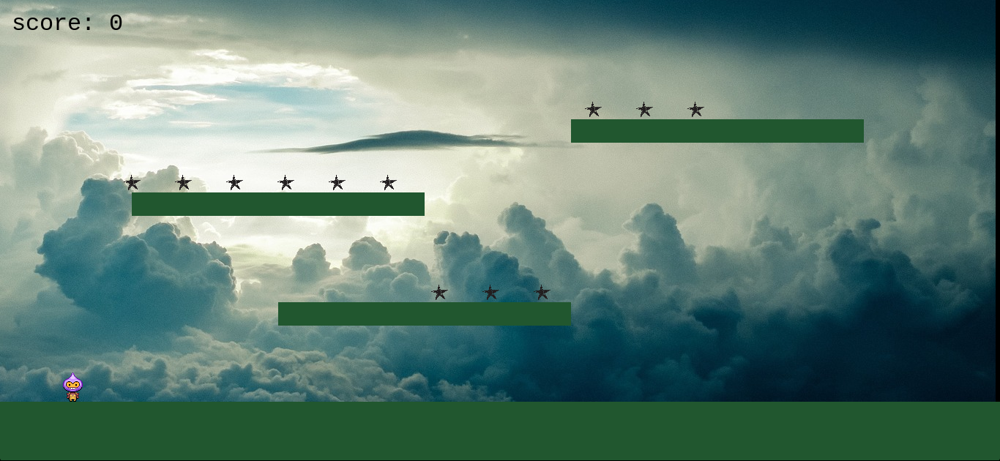

# phasgming
A repository consisting of online games made using Phaser Framework. Phaser is an open source HTML5 framework which is used to make 2D games using HTML5 and JavaScript.

## Folder Structure
---

|  assets---  (Additional media)  
|  js---(Main Javascript)   
|  index.html---(webpage for game)

## Mock Game
---
The mock game is made using the tutorial present on [phaser.io](https://phaser.io/tutorials/making-your-first-phaser-3-game/index)

It works in the following manner:

- Player moves with left and right arrow keys and jump with up arrow key
- Each star adds up +10 to the score
- Once all stars are collected the respawn, this time, with a bomb bouncing around the screen
- **Challenge is to score the highest**

**PLAY LIVE**: [https://akshat0047.github.io/phasgming/Mock-Game](https://akshat0047.github.io/phasgming/Mock-Game)  



## Contributing Guidelines
---

-  Fork the repository  

-  Clone the repository with 

```sh
$ git clone "https://github.com/username/phasgming.git
```
- Create a branch to work upon
 ```sh
$ git checkout -b branchname
 ```
- Add your changes and commit them 
 ```sh
$ git add -A
$ git commit -m"meaningful commit message"
 ```
- Push your changes to your forked copy
 ```sh
$ git push origin master
 ```
- Make a Pull Request
---
**The project is licensed under MIT License**


